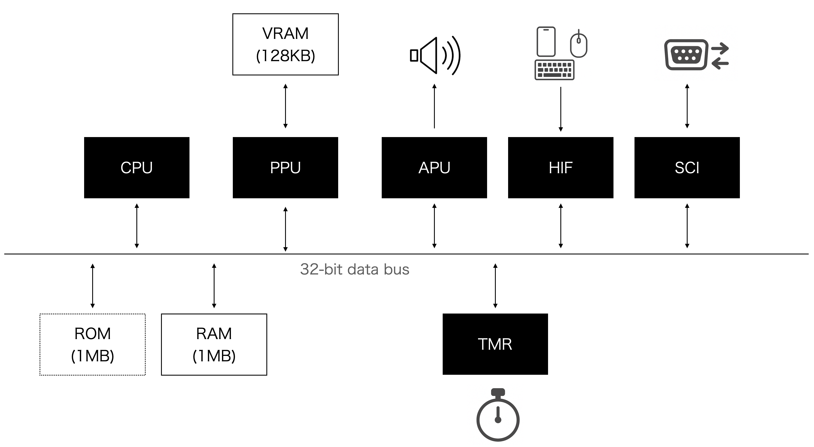

# BEEP-8 SDK

**BEEP-8** is a virtual retro game console designed for developing C/C++ applications. It runs on an emulated ARM v4 CPU at a fixed 2 MHz and is optimized for vertical smartphone displays. The SDK adopts a two-layer architecture: at the low level, developers can directly access hardware (H/W) through minimal APIs. At the high level, developers are free to choose their own structure, frameworks, or libraries to build applications. A PICO‑8–like C/C++ library is provided as one such option for rapid and familiar development, but it is entirely optional.

The emulator runs directly in modern web browsers—Chrome, Safari, Firefox, Edge—across PCs, iPhones, iPads, Android devices, and virtually any platform. WebGL ensures a consistent 60 fps experience, even on older devices such as the iPhone 6. As part of its roadmap, BEEP‑8 is also being extended with official support for the Nintendo Switch platform.

---

## Features
## System Block Diagram



- **Emulated CPU:** ARM v4 running at a fixed 2 MHz.  
  - Based on an architecture originating in the mid-1990s.  
  - Compilable using GNU ARM GCC and supports C++20.

- **Memory:** Main RAM is 1 MB and VRAM is 128 KB (shared for BG and sprite patterns, 4 bpp, 512×512).

- **ROM Limit:** Maximum size is **1024 KB** per game.

- **PPU (Pixel Processing Unit):** Handles all rendering operations including background layers, sprites, and shape drawing.  
– Drives the 128×240 pixel display using a fixed 16-color palette.  
– Shares access to 128 KB of VRAM with both BG and sprite patterns (4 bpp, 512×512 layout).

- **APU (Audio Processing Unit):** Emulates a Namco C30-style sound engine.  
– Supports 8 audio channels with real-time synthesis.  
– Provides retro-style sound effects and music playback.

- **HIF (Human Interface):** Fully supports keyboard, mouse, and **touch inputs** via a dedicated HIF module.
– Converts browser input events into system-level signals.  
– Ideal for both PC and mobile web environments.

- **TMR (Timer Module):** Provides high-precision system timing for scheduling and interrupts.  
– Drives periodic system tasks at a consistent 60 Hz tick rate.  
– Integrated with the custom RTOS (`b8OS`) for real-time operations.

- **Custom RTOS (`b8OS`):**  
  - A lightweight real-time operating system that supports multi-threading, semaphores, interrupt handlers, and a simple in-memory file system.  
  - Designed to provide a minimal set of UNIX-like APIs tailored for game development.  
  - Enables asynchronous components, such as sound drivers operating independently from the main thread, to be implemented with ease.
  - Its architecture allows developers to focus on gameplay logic without dealing with complex OS-level implementation details.

- **Development Environment:**  
  - Advanced developers can directly control virtual hardware components (e.g., PPU, APU, I/O registers).  
  - Alternatively, a PICO-8-like C/C++ library is available for rapid development.  
  - All C/C++ source code is fully open and available for modification.

- **Distribution:**  
  - Completed games are delivered as a single ROM file.  
  - Developers can release their games on the official BEEP‑8 portal site: [https://beep8.org](https://beep8.org)  
  - The portal serves as a shared space where everyone can upload, discover, and play games created by the community.

- **Cost:**  
  - The SDK is completely free to use, and game releases are free as well.


---

## Quick Start

You can get started with the SDK in one of the following ways:

- **Option 1: Clone the Repository (Recommended for Git Users)**  
  ```bash
  git clone git@github.com:beep8/beep8-sdk.git

- **Option 2: Download as a .tar.gz Archive (No Git Required)
  Download the latest SDK source code directly as a .tar.gz file:
  https://github.com/beep8/beep8-sdk/archive/refs/heads/main.tar.gz
  This is ideal for users who prefer not to use Git. On macOS and Linux, the archive can be extracted with built-in tools.
  💡 Tip: On Windows, we recommend using 7-Zip to extract .tar.gz archives safely.

2. **Build a Sample Application:**
    BEEP‑8 applications are built by directly manipulating the virtual hardware registers in C/C++. 
    There is no predefined framework—developers can code in any style using custom libraries or modules.
    Full support up to C++20, including the STL, means that most existing C++ libraries can be
    built and run on BEEP‑8.

    At the same time, we also provide a PICO‑8–style sample library for developers familiar with PICO‑8 game development to use.
    Navigate to the SDK directory and run make:
    ```bash
    cd ./beep8-sdk/sdk/app/pico8_example
    make clean
    make
    ```

3. **Run the Emulator:**
   In your terminal, change to the example directory and run:
   
   ```bash
   cd ./beep8-sdk/sdk/app/pico8_example
   make run
   ```

   This command launches the built BEEP‑8 ROM (`b8rom`) in your default web browser. BEEP‑8 uses Google Chrome by default, so ensure Chrome is installed on your system.
   
   > **Note:** In BEEP‑8, output from `printf()` is not rendered on‑screen—it appears in the debug console (the log panel on the right side of the emulator UI).

---

## API Documentation

For complete API details, please refer to the header files in the `include/` directory. Key headers include:
- **pico8.h:** Defines the high-level API for graphics, sound, and input.
- **Other headers:** Provide low-level interfaces for the PPU, APU, and RTOS (`b8OS`).

---

## Sample Application

Below is a minimal "Hello World" sample that demonstrates a BEEP-8 application:

```c
#include <stdio.h>
#include <beep8.h>

int main(void) {
  // Print debug output; on BEEP-8, printf() output is sent to the
  // emulator's debug console (visible on the side) rather than on-screen.
  printf("hello BEEP-8\n");
  return 0;
}
```

> **Note:** Although this sample exits immediately after printing, it serves as the simplest example to illustrate how to compile and run a BEEP-8 application.

---

## License

This project is licensed under the MIT License. See the LICENSE file for details.

---

## Contact

- **Email:** [beep8.official@gmail.com](mailto:beep8.official@gmail.com)
- **Website:** [https://beep8.org](https://beep8.org)

---

*Happy coding with BEEP-8!*
